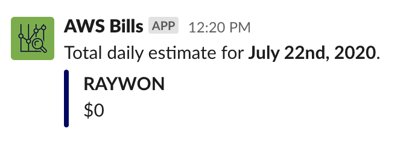

## Overview

```
├── appconfig.json
├── lambda.js
├── package-lock.json
└── package.json
```

### appconfig.json 

* This file consists of the config values used by the lambda function.
* This file needs to be updated with the slack webhook url, along with the list of AWS accounts you want to receive daily costs, just append more account names and IDs in the config.
* You can specify multiple groups of accounts and slack webhooks, this is helpful if you want to relay cost info of accounts belonging to different teams into their respective slack channels.

### lambda.js

* This is the actual code used in the lambda function.
* It reads and fetches the config file and queries cost explorer API for cost information. Then the function handles the response. If the response is empty, it will send cost not updated message, and if the response is not empty, it will parse the cost details and sends a slack message.

Example: 




### MISC

* When creating the incoming webhook, I have uploaded an ICON for the app. You can also do the same, by uploading your own icon. I have used the icon `../images/cost-explorer.png` present in this directory.