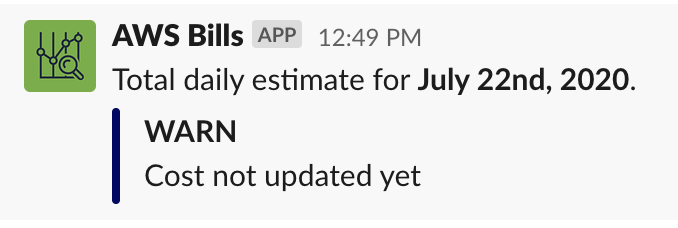
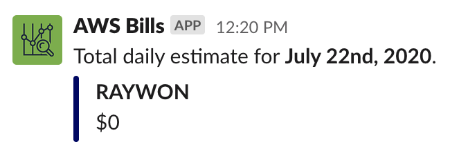

## Overview

```
├── appconfig.json
├── lambda.js
├── package-lock.json
└── package.json
```

### appconfig.json 

* This file consists of the config values used by the lambda function.
* This file needs to be updated with the slack webhook url, along with the list of AWS accounts you want to receive daily costs.

### lambda.js

* This is the actual code used in the lambda function.
* It reads and fetches the config file and queries cost explorer API for cost information. Then the function handles the response. If the response is empty, it will send cost not updated message, and if the response is not empty, it will parse the cost details and sends a slack message.

Example: 


